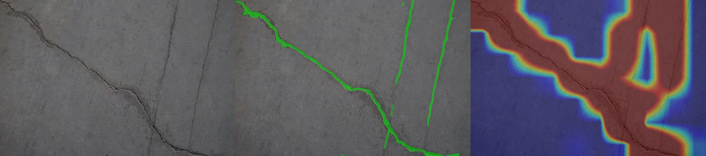
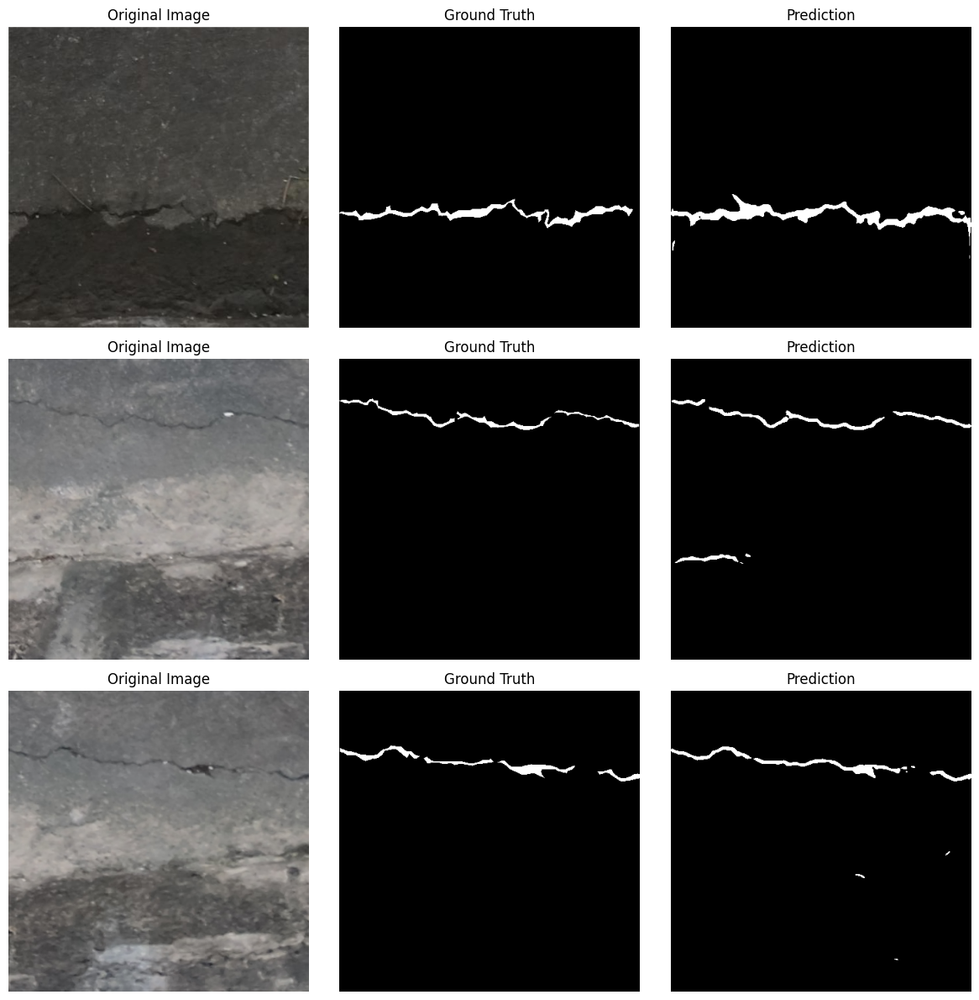

# crack-seg


[](https://huggingface.co/ishaan1402/crack-seg)


Automated crack detection from high-resolution UAV bridge imagery; powered by U-Net, an Encoder-Decoder CNN model with skip connections. 

**Poster:** [Automated Bridge Surface Crack Detection using UAV Imagery and Deep Learning Segmentation](references/bridge_crack_detection_poster_final.pdf) — AI Student Symposium 2026

**Model weights:** [ishaan1402/crack-seg](https://huggingface.co/ishaan1402/crack-seg) on Hugging Face

## Output

### Inference

<p align="center">
  
  <br/>
  <em>Figure 1: UAV Drone Imagery (Left) → Crack Segmentation Mask (Center) → Local Density Heatmap (Right)</em>
</p>

### Test Set Evaluation

<p align="center">
  
  <br/>
  <em>Figure 2: UAV Drone Imagery (Left) → Ground Truth (Center) → U-Net Segmentation Prediction (Right)</em>
</p>

---

## SparkNotes

**Problem:** Bridge inspections are slow, dangerous, expensive, and require lane closures or scaffolding. Inspectors need to locate thin cracks in thousands of square feet of concrete. High-res drone images (4K/8K) normally exceed GPU memory limits if fed directly, while downsampling destroys detail in said images.

**What this does:** Outputs clean pixel-level segmentation masks of cracks from high-res UAV bridge photos. Sliding window inference tiles high-res imagery, runs U-Net segmentation on overlapping patches, and blends them using a 2D Gaussian weight map. This application also tracks cracked-area ratio, compiles local density heatmaps, and serves predictions via a FastAPI endpoint.

**Why `crack-seg`?**
UAV bridge imagery is typically full of high contrast structure that isn’t structural damage (joints, shadows, stains, and aggregate). Pipelines built on small patch classifiers, like our Random Forest baseline, or fixed gradient thresholds often miss thin cracks or flag false positives when lighting and surface type change.

crack-seg uses pixel-level U-Net segmentation so the model can use neighboring context rather than classifying each patch from local texture alone. Dense masks support metrics such as cracked-area ratio and density maps which cannot be obtained from bounding boxes or per-patch labels alone.

**Training:** the current pipeline is [edu/train_v3.ipynb](edu/train_v3.ipynb) — multi-source data staging (UAV Kaggle + DeepCrack + UAV 11k), training the upgraded U-Net (SE blocks, bottleneck dropout, deep supervision, AMP/cosine/EMA), and evaluation on the staged test split plus the held-out DeepCrack test. The same scheme runs outside Colab via `scripts/train.py`.

**Evaluation:** `scripts/verify_metrics.py` reports global + per-image Dice/IoU/Recall/Precision at any threshold; published model-card numbers are generated with it.

---

## Model & Results

### Checkpoints

| File | Architecture | Notes |
| --- | --- | --- |
| `unet_v3.pth` | U-Net `[32,64,128,256]` + SE blocks + deep supervision | **Recommended.** Trained 2026-08 on multiple data sources (UAV Kaggle + DeepCrack train + merged crack sources), 512px, BCE+Dice, Adam 5e-4 + cosine, EMA. |
| `unet_narrow_v2.pth` | U-Net `[32,64,128,256]` | Tuned via internal hyperparameter optimization tool: [Pathfinder](https://github.com/Ishaan1402/pathfinder) |
| `unet_wide_v1.pth` | U-Net `[64,128,256,512]` | Original notebook model (4× params). |

All checkpoints load through the same code path — the loader (`src/models/checkpoint.py`) auto-detects channel widths, legacy key naming, SE/deep-supervision heads, and upsample mode.

### Metrics (threshold 0.5, direct full-image inference)

**Held-out staged test split (447 pairs)**

| Model | Dice | IoU | Recall | Precision |
| --- | --- | --- | --- | --- |
| **v3** | **0.730** | 0.575 | 0.739 | 0.721 |
| narrow-v2 | 0.310 | 0.183 | 0.200 | 0.690 |
| wide-v1 | 0.339 | 0.204 | 0.231 | 0.634 |

The staged test split is the clean in-distribution held-out benchmark (only the val split is used for checkpoint selection). The old models were trained on UAV-only data, which is why they drop sharply here.

**DeepCrack test set (237 images)**

| Model | Dice | IoU | Recall | Precision |
| --- | --- | --- | --- | --- |
| **v3** | **0.866** | **0.764** | **0.867** | **0.866** |
| narrow-v2 | 0.720 | 0.562 | 0.656 | 0.797 |
| wide-v1 | 0.775 | 0.633 | 0.727 | 0.830 |

⚠️ DeepCrack *train* was part of v3's training data, so the DeepCrack test number is held-out but **in-distribution**, not cross-domain. The staged test split above is the harder held-out benchmark.

### Training (v3)

Data: UAV Kaggle (fresh random 70/15/15 split), DeepCrack train (300), and a capped subset of a merged 11.2k crack dataset (CRACK500, CFD, GAPS384, Rissbilder, Volker, Sylvie, forest, cracktree200, noncrack), all resized to 512×512 with binary masks and ImageNet normalization.

Model: narrow U-Net + squeeze-and-excitation, bottleneck dropout 0.1, deep supervision, 512px, BCE+Dice (aux-weighted), Adam lr 5e-4 with 3-epoch warmup + cosine decay, EMA, AMP, 30 epochs, best-by-val-Dice. Validation Dice ≈ 0.73 global / 0.66 macro at completion.

---

## Repo Structure

```text
crack-seg/
├── config/              # YAML configs
├── edu/                 # Training notebook (train_v3.ipynb)
├── scripts/             # Developer CLI tools
│   ├── train.py              # Training scheme (also used by the notebook)
│   ├── prepare_dataset.py    # Dataset -> train/val/test layout
│   ├── colab_data.py         # Download/stage helpers for train_v3.ipynb
│   ├── verify_metrics.py     # Checkpoint evaluation harness
│   ├── download_checkpoint.py # Model fetcher
│   └── threshold_sweep.py    # Precision-Recall threshold sweep
├── src/                 
│   ├── config/          # Pydantic schema validation
│   ├── dataset/         # PyTorch dataset & Albumentations transforms
│   ├── inference/       # Sliding window predictor
│   ├── metrics/         # Spatial density heatmaps
│   ├── models/          # Custom U-Net, in PyTorch
│   ├── utils/           # Visual overlay output helpers
│   └── app.py           # FastAPI server
└── tests/               # Pytest unit and integration test suite
```

---

## Features

### 1. Sliding Window Inference (`src/inference/`)

High-resolution drone photos cannot fit in the model all at once, so we seperate them into overlapping squares, run the model on each square, then stitch the results back together.

- Default patch size is 448×448 with 50% overlap (each step moves 224px).
- Overlapping regions are averaged together. Patches near the center of each square are weighted more than edges in order to remove the seam lines between tiles.
- Images at or below the patch size take a single full-image forward pass (the model is fully convolutional) — faster and free of padded-border artifacts.

### 2. Crack Density Heatmaps (`src/metrics/`)

Converts the binary crack mask into a colored map showing where damage is clustered.

- Splits the image into grids (e.g. 64×64 pixel blocks).
- Each grid receives a proportioned crack percentage (% of pixels marked as crack).
- Grid is upsampled back to original image size and colored in: [blue = undamaged, red = severely cracked]

### 3. API server (`src/app.py`)

FastAPI app serving predictions over HTTP.

- `/health` — verifies that the server is running and the model is loaded.
- `/predict` — receives an image and returns an overlay. Query params: `threshold`, `overlap`, `overlay_type` (`mask`, `heatmap`, or `both` side by side).
- Validates uploads: allowed formats (`jpg`, `png`, `webp`, `tiff`), max 50 MB, image dimensions between 256 and 8192 px.
- Returns statistics in response headers: cracked area %, inference time, and whether any crack was detected.

### 4. Docker (`Dockerfile`)

- **Build** — installs dependencies and downloads model weights from Hugging Face at build time.
- **Run** — runs as non-root user (`appuser`), starts Uvicorn.

---

## Local Development & Usage

### 1. Run Local Installation

Requires Python 3.10+ to be installed:

```bash
# Create venv and install packages
python3 -m venv .venv
source .venv/bin/activate
pip install -r requirements.txt

# Run all unit and integration tests
.venv/bin/pytest tests/
```

### 2. Launch FastAPI Server

```bash
# Start the server locally on port 8000
.venv/bin/uvicorn src.app:app --reload --host 127.0.0.1 --port 8000
```

Test endpoints via cURL:

```bash
# Get health status
curl http://127.0.0.1:8000/health

# Predict and save a side by side comparative panel
curl -X POST -F "file=@input/example_1.jpeg" \
  "http://127.0.0.1:8000/predict?overlay_type=both&threshold=0.5&overlap=0.5" \
  --output "output/result_panel_$(date +%Y%m%d_%H%M%S).jpg"

  # Predict, save a side by side comparative panel, and report response headers
  curl -X POST -F "file=@input/example_1.jpeg" \
  'http://127.0.0.1:8000/predict?overlay_type=both&threshold=0.5&overlap=0.5' \
  -o "output/result_panel_$(date +%Y%m%d_%H%M%S).jpg" \
  -D -
```

### 3. Generate Precision-Recall Curve Profiles

Execute a threshold parameter sweep on test splits:

```bash
python scripts/threshold_sweep.py --data_dir /path/to/my_split_dir --output_dir reports/
```

Match up the best performing thresholds which maxes overall Dice and displays performance charts in `reports/pr_curve.png`.
